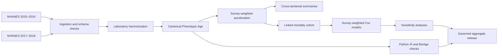

<div align="center">

# AgeLens

### Reproducible Phenotypic Age analysis in NHANES 2015–2018

A governed and survey-aware implementation of **Levine Phenotypic Age**,  
with laboratory harmonization, cross-implementation checks, and  
all-cause mortality analysis.

[](https://github.com/alikinis/AgeLens/actions/workflows/repository-safety-check.yml)
[](LICENSE)
[](requirements-v2.txt)
[](R_PACKAGES.md)
[](#data-policy)

**Author:** Ali Kınış · Independent Researcher, İzmir, Türkiye

</div>

---

## Release map

> **Current V2 maintenance release: AgeLens V2.0.5.** This branch and the
> `v2.0.5` tag retain the unchanged functional-health validation,
> transportability, cross-cycle prediction, restricted explainable-model
> evaluation, and 108-artifact cryptographic no-change invariant while
> correcting the public-release date metadata recorded for V2.0.4.
> Start with [`docs/v2/README.md`](docs/v2/README.md) and the
> [`V2.0.5 maintenance record`](docs/v2/V2_0_5_Maintenance_Release.md).
>
> The CI-runtime release, **AgeLens V2.0.4**, remains preserved in
> [`V2_0_4_Maintenance_Release.md`](docs/v2/V2_0_4_Maintenance_Release.md).
> The invariant-coverage release, **AgeLens V2.0.3**, remains preserved in
> [`V2_0_3_Maintenance_Release.md`](docs/v2/V2_0_3_Maintenance_Release.md).
> The documentation/tooling release, **AgeLens V2.0.2**, remains preserved in
> [`V2_0_2_Maintenance_Release.md`](docs/v2/V2_0_2_Maintenance_Release.md), and
> the earlier integrity release, **AgeLens V2.0.1**, remains preserved in
> [`V2_0_1_Maintenance_Release.md`](docs/v2/V2_0_1_Maintenance_Release.md).
> The frozen mortality-replication line remains available as V1.0.2 on `main`.
> Full V2 reproduction uses [`requirements-v2.txt`](requirements-v2.txt); CI
> validator dependencies are pinned in [`requirements-ci.txt`](requirements-ci.txt).

## Overview

AgeLens is a reproducible implementation of **Phenotypic Age** in the
2015–2016 and 2017–2018 cycles of the U.S. National Health and Nutrition
Examination Survey (NHANES).

The project focuses on decisions that are often hidden in biological-age
replications:

- laboratory-method transitions across NHANES cycles;
- biomarker units and published formula constants;
- age top-coding at 80 years;
- complete-case construction in the fasting subsample;
- pooled complex-survey weights, strata, and primary sampling units;
- cross-implementation agreement between Python and R;
- explicit governance of assumptions, evidence gaps, and release decisions.

This public repository contains code, governed methodology, aggregate results,
and reproducibility records. It does **not** distribute participant-level data
or the unpublished manuscript.

---

## Main result

| Analysis | Result |
|---|---:|
| Canonical complete-case sample | **5,223 participants** |
| Mortality cohort | **4,350 adults** |
| Observed deaths | **127** |
| Exposure | Phenotypic Age acceleration |
| Primary effect scale | Per 5-year increase |
| Adjusted all-cause mortality HR | **1.185** |
| 95% confidence interval | **1.129–1.245** |

The primary survey-weighted Cox model adjusted for chronological age, sex,
race/ethnicity, and NHANES cycle.

> Higher Phenotypic Age acceleration was associated with higher all-cause
> mortality hazard. This is an observational association and should not be
> interpreted causally.

---

## Analysis workflow



---

## What is included

| Area | Contents |
|---|---|
| `notebooks/` | Public-safe copies of the complete analysis workflow |
| `scripts/analysis/` | R scripts for validation and survey-weighted survival analysis |
| `config/` | Final governed project configuration |
| `docs/governance/` | Decision log, assumption register, and evidence-gap register |
| `docs/governed/` | Protocols, harmonization, methodology, and validation reports |
| `results/tables/` | Aggregate cross-sectional, mortality, diagnostic, and baseline tables |
| `results/figures/` | Final aggregate figures |
| `release/` | Notebook integrity records and public-release provenance |
| `scripts/preflight_repository.py` | Safety check for raw data, secrets, personal paths, and unsafe files |

Public notebook copies have local execution paths redacted and rendered
participant-level preview outputs removed. Three display-only source
statements were changed to aggregate schema/count summaries so rerunning the
notebooks does not recreate participant rows. Scientific calculation cells,
results, tables, and figures were not changed. The relationship between the
governed and public notebook hashes is recorded in:

- `release/public_notebook_inventory.csv`
- `release/public_notebook_sanitization.json`

---

## Reproduction order

Run the notebooks in numerical order:

```text
00_setup_agelens.ipynb
01_data_ingestion.ipynb
02_data_preprocessing.ipynb
03_validation.ipynb
04_external_validation.ipynb
05_validation_completion.ipynb
06_eg004_creatinine_sensitivity.ipynb
07_governance_resolution.ipynb
08_canonical_output_rebuild.ipynb
09_mortality_analysis_authorization.ipynb
10_mortality_survival_analysis.ipynb
11_final_reporting_and_release_package.ipynb
11b_release_package_rebuild.ipynb
12_baseline_characteristics.ipynb
```

The `11b` notebook rebuilds the final aggregate release after governance
finalization. The `12` notebook creates the publication-oriented descriptive
baseline tables.

---

## Quick start

### 1. Clone the repository

```bash
git clone https://github.com/alikinis/AgeLens.git
cd AgeLens
```

### 2. Create a Python environment

```bash
python -m venv .venv
```

Windows PowerShell:

```powershell
.\.venv\Scripts\Activate.ps1
```

macOS or Linux:

```bash
source .venv/bin/activate
```

### 3. Install Python dependencies

```bash
python -m pip install --upgrade pip
pip install -r requirements-v2.txt
```

### 4. Install the R dependencies

See [`R_PACKAGES.md`](R_PACKAGES.md).

### 5. Obtain the source data

Download the required public NHANES files from official NCHS sources and keep
them locally. Raw files are intentionally excluded from this repository.

### 6. Run the notebooks

```bash
jupyter lab
```

---

## Software environment

The final governed execution used:

| Component | Version |
|---|---:|
| Python | 3.13.14 |
| NumPy | 2.4.6 |
| pandas | 3.0.5 |
| SciPy | 1.18.0 |
| scikit-learn | 1.9.0 |
| `interpret` | 0.7.8 |
| R | 4.5.1 |
| `survey` | 4.5 |
| `survival` | 3.8-3 |

See [`requirements-v2.txt`](requirements-v2.txt),
[`docs/v2/V2_Environment.md`](docs/v2/V2_Environment.md), and
[`R_PACKAGES.md`](R_PACKAGES.md) for environment details.

---

## Reproducibility and governance

AgeLens uses a replication-first workflow in which consequential choices are
recorded before final release.

Key safeguards include:

- explicit biomarker unit and harmonization policies;
- canonical and alternative published formula constants;
- age-topcode and creatinine-scale sensitivity analyses;
- complete-case and survey-design checks;
- Python–R cohort and design reconciliation;
- proportional-hazards diagnostics;
- release checks and SHA-256 notebook provenance;
- aggregate-only public distribution.

The governed records are available under
[`docs/governance/`](docs/governance/) and
[`docs/governed/`](docs/governed/).

---

## Data policy

This repository does **not** contain:

- raw NHANES `.XPT` files;
- mortality fixed-width source files;
- participant-level Parquet or other processed datasets;
- interim analytic cohorts;
- personally identifiable information;
- cause-specific mortality outputs;
- the unpublished manuscript or supplementary manuscript.

Users must obtain source data from official NCHS channels and comply with the
applicable data-use terms.

---

## Repository safety check

Before every push, run:

```bash
python scripts/preflight_repository.py .
```

The check rejects:

- raw and participant-level data extensions;
- sensitive directory names;
- common secret-token and private-key patterns;
- personal absolute user paths;
- damaged ZIP files;
- files larger than 50 MiB.

The same check runs automatically through GitHub Actions. The workflow
uses Python 3.13 and installs the minimal governed validator dependency
set from `requirements-ci.txt` before executing the V2 release chain.

---

## Citation

Until a DOI is assigned, cite the software repository as:

> Kınış A. **AgeLens**. Version 2.0.5. 2026.
>
> https://github.com/alikinis/AgeLens

Machine-readable citation metadata are available in
[`CITATION.cff`](CITATION.cff).

---

## License

Code, notebooks, scripts, and configuration are licensed under the
[MIT License](LICENSE).

NHANES data are not distributed in this repository and remain subject to their
original NCHS/CDC terms.
